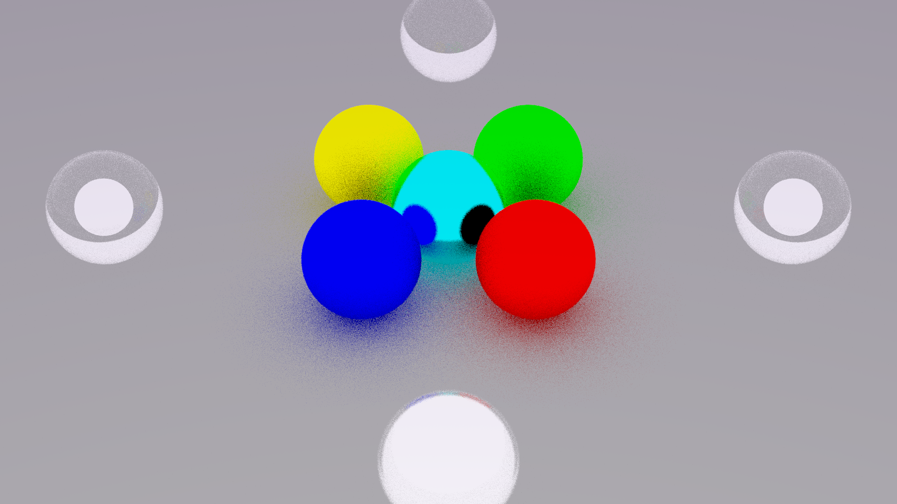

# Drunk Raytracer

Drunk Raytracer is, well a raytracer, but completely written in C#. Yet we can complain of this unusual technological choice, this basic ray-tracer application is meant to be comprehensive, safe and highly adaptable to any further modification. That is probably because I prefer C# to C++ though.

Furthermore, this is also an adaptation of the fantastic introduction series to raytracing by Peter Shirley ([find it here](http://www.realtimerendering.com/raytracing/Ray%20Tracing%20in%20a%20Weekend.pdf)). 

Currently provided as a Microsoft Visual Studio 2019 solution, fully written in C# .NET Core 2.2.
To use it:

1- Adapt your scene in `Program.cs` file in the `RTIOWCS_Console` project.
2- Compile and launch the project !

## Features

- Spheres. Yeah!
- Diffuse, Dielectric and Metal materials.
- Somehow a adaptative camera.
- Antialiasing, very simple.

Output is provided as a .ppm file.

## Next

- Obviously, adapt Chapter 2 and 3 of Peter Shirley's serie!
- Still looking for a good way to create a GUI application to edit the scene, and visualize the rendering while computing.

